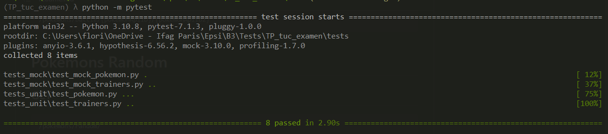
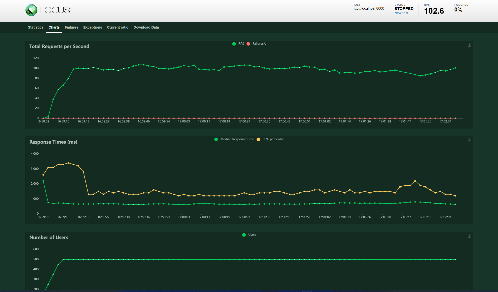
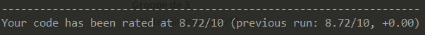

# Projet Examen de l'Atelier methodologie de tests

## Groupe

- [Jaulin Florimond](https://github.com/Jflo02)
- [Petit Rémi](https://github.com/piett-rm)
- [Bammez Paul](https://github.com/bammezpaul)

## Travail réalisé

Ajouts de méthodes et routes à l'application

- Route ( + méthode ) get /pokemons/battle/{first_pokemon_id}/{second_pokemon_id}
- fonction battle_pokemon() => compare les stats de deux pokemons afin de définir un vainqueur

Ajout de tests unitaires

- test_get_pokemons() => test la route /pokemon
- test_get_pokemon_id() => test le fonctionnement de la fonction get_pokemon_data()
- test_battle_pokemon_vainqueur() => test la fonction battle_pokemon()
- test_get_trainers() => test la route /trainers
- test_post_api_trainers() => test l'ajout d'un trainer en base

Ajout de tests mockées

- test_get_pokemons() => mock la bdd afin de tester que la route /pokemons/ renvoient tous les pokemons
- test_get_trainers() => mock afin de verifier que la route /trainers renvoie les trainers de la bdd
- test_get_trainer() => test de la route pour avoir un dresseur en particulier

Scenario de test de charge Locust dans le dossier /tests/locust

Pytest



Locust



Pylint



## Préparation de l'environnement

Créer l'environnement virtuel `python -m venv .`

### Activer l'environnement

**Sur Windows**

Executer le script en .ps1 \Scripts\ `.\Activate.ps1`

**Sur Linux**

Executer le script en .bat \Scripts\ `Activate.bat`

Installer les paquets
`pip install -r requirements.txt`

## Démarer localement

Lancer le serveur de dévelopemment

```bash
uvicorn main:app --reload
```

## Lancer les tests

Pytest

```bash
python -m pytest
```

Locust

> Se placer dans le dossier /tests/locust

```bash
locust
```

Pylint

```bash
pylint application/ tests/
```

Coverage

```bash
coverage run -m pytest --profile
```
